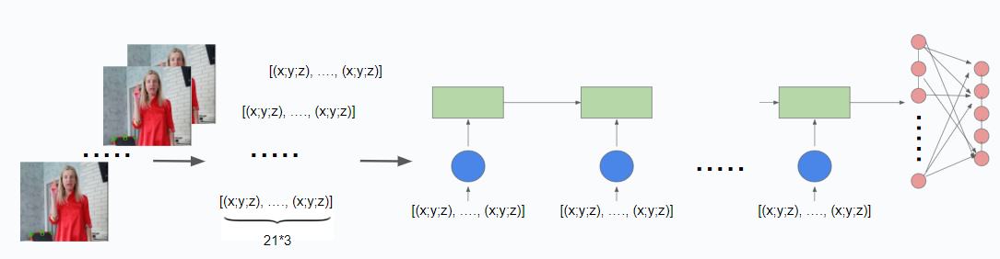

# Russian Sign Language Recognition
This repository contains the code for final project of Computer Vision course at Innopolis university. For this project we chose to create real-time recognition app for Russian Sign Language recognition.

# How to run code
To install all dependencies for this project run

    pip install -r requirements.txt

For training the model use `train.ipynb` file.

For trying real-time recognition run:

    python real_time_detection.py

# Approach
For this project we chose to use hand keypoint detection with MediaPipe and classification of sequences of detected keypoints. We used [Slovo dataset](https://github.com/hukenovs/slovo) as our training data and extracted keypoints from frames. For now we use only right hand for recognition and the supported classes are: Привет! (Hi!), Пока (Bye), Я (I), Люблю (Love), Тебя (You). Sequence classification is approached with LSTM model. Our pipeline is:

